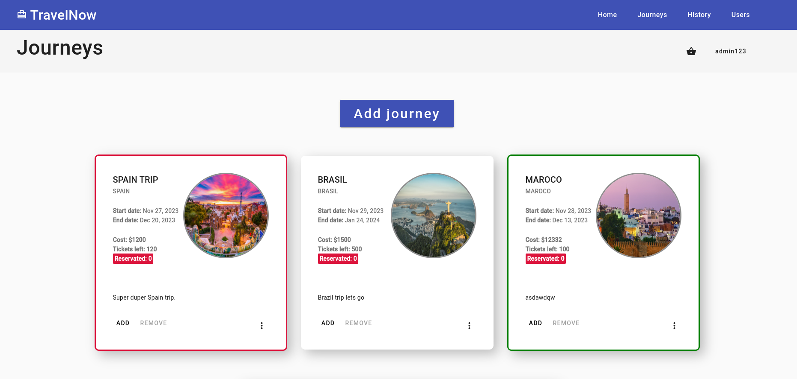
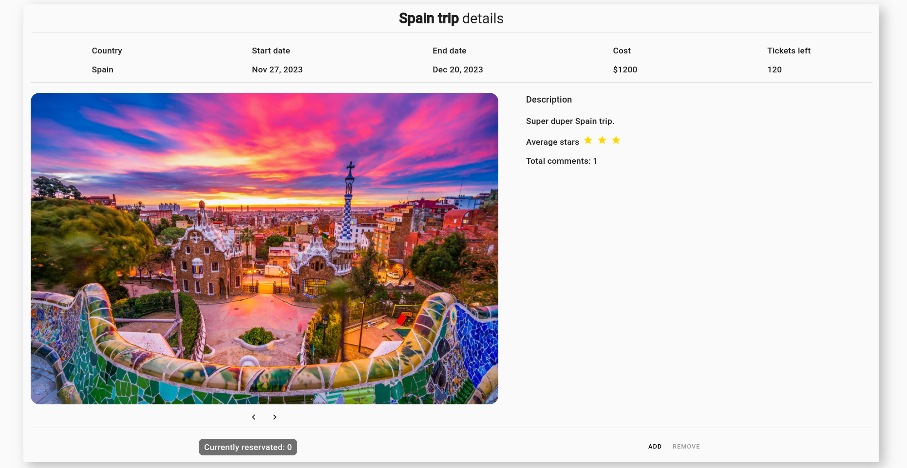
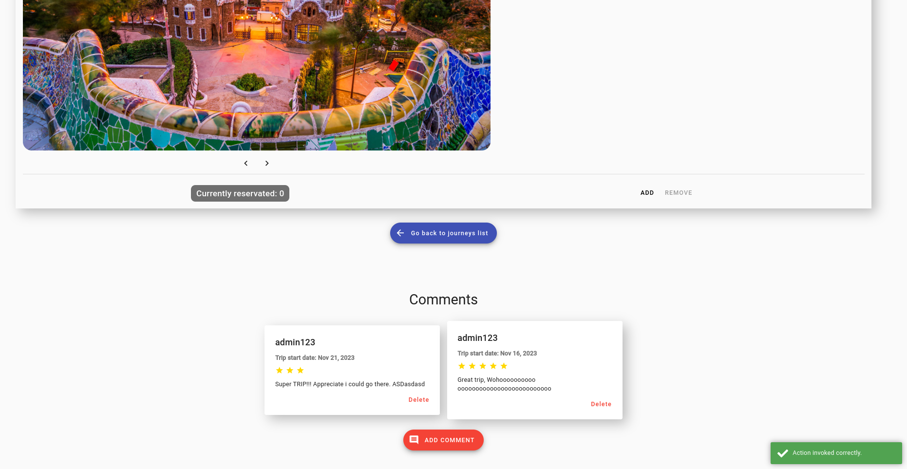
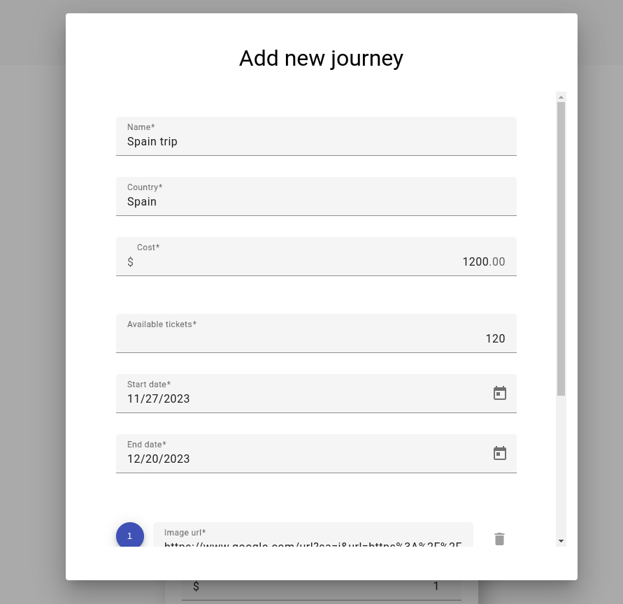
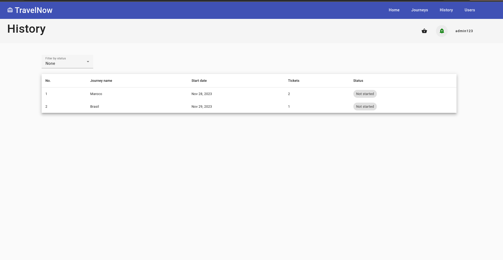
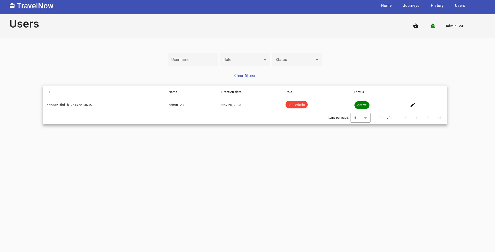
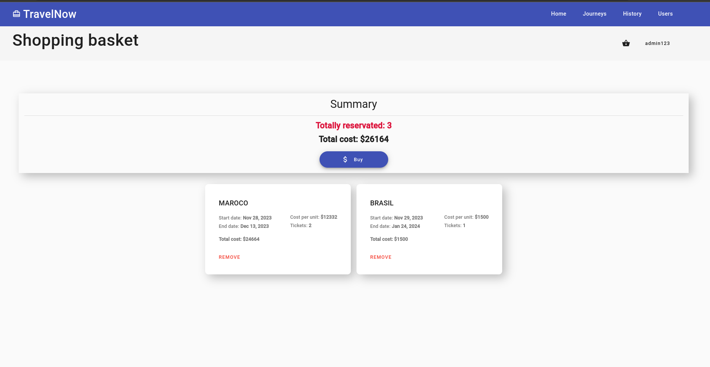

# Travel now

## About
Travel now is an application that was made as a project for second's year 
subject: Introduction to Web Applications. Its main idea is to be able to
manage journeys. 

## Main technologies
`Node JS` `Express JS` `JWT` `MongoDB` `Angular` `Angular Material UI`

App was created using Angular 15.0.0 and Node JS 16.18.1. For more detailed information
please read README of each section ([client](./client/README.md), [server](./server/README.md)).

## Features
Application provides features to manage journeys, users, journey comments (CRUD).

## Authentication and Authorization / Users
Application is based on JWT logic. It is strictly connected with users differencing, because every user
has role in the system that is providing to GUI with usage of token payloads.

# Application start
Before start, you need to specify your database username and password in server module. To learn about it visit [server](./server/README.md).

After db setup, you can either run application using created bash file by executing
```bash
./run.sh
```
or by running each module one by one.

### Run server

```bash
cd ./server
npm i
npm run dev
```

### Run client

```bash
cd ./client
npm i
ng serve --open
```

# Sample views

### Journeys


### Journey details


### Journey comments


### Create journey


### History


### Users


### Basekt
